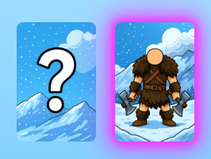
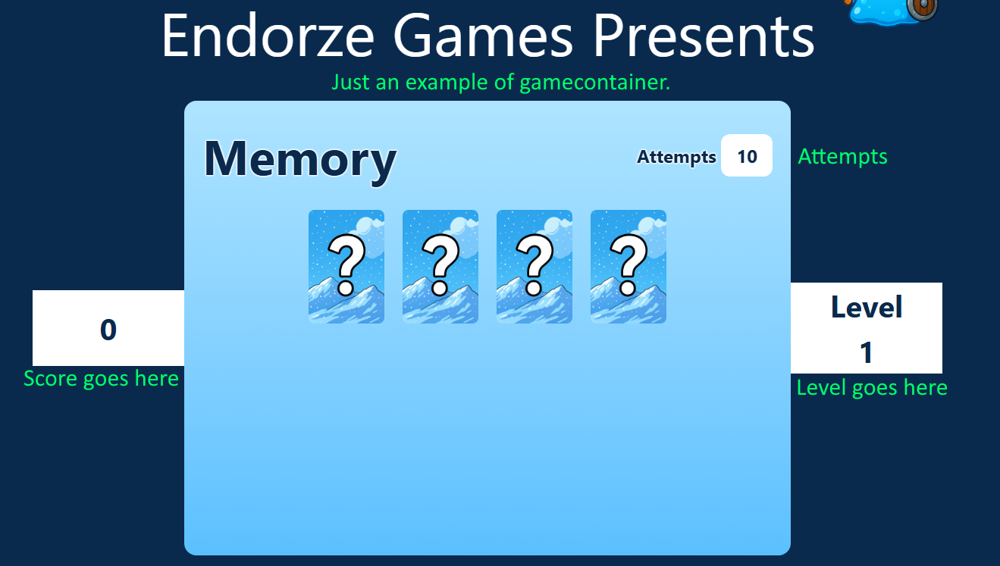
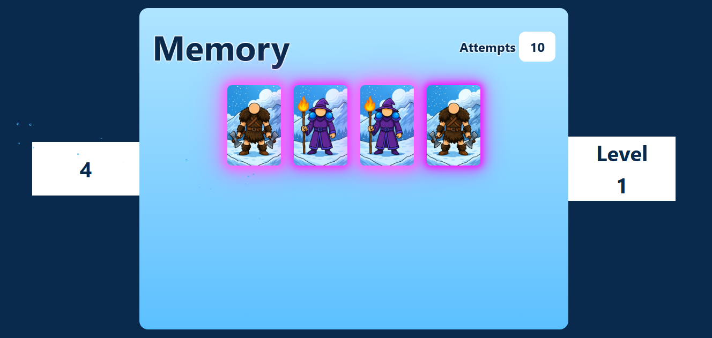
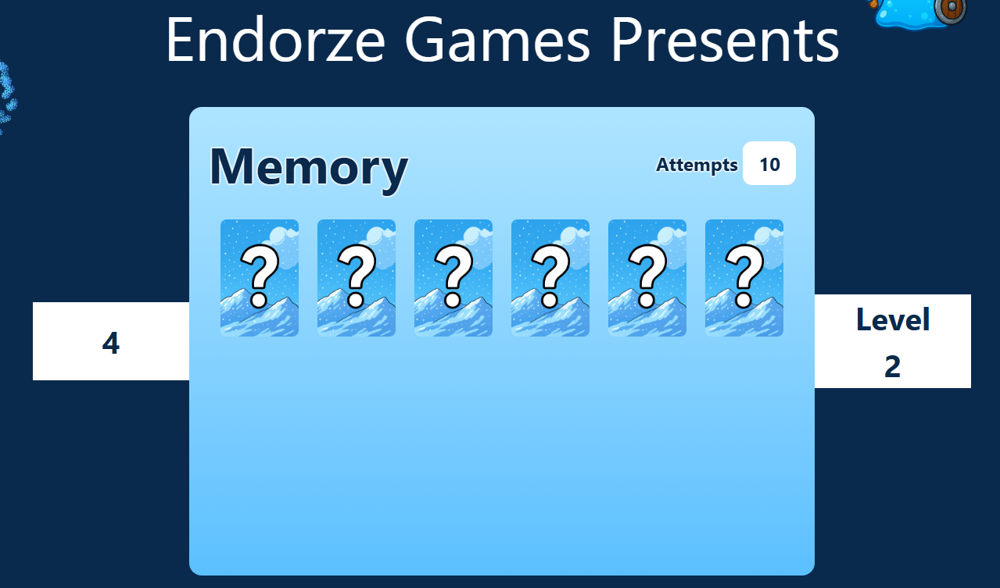
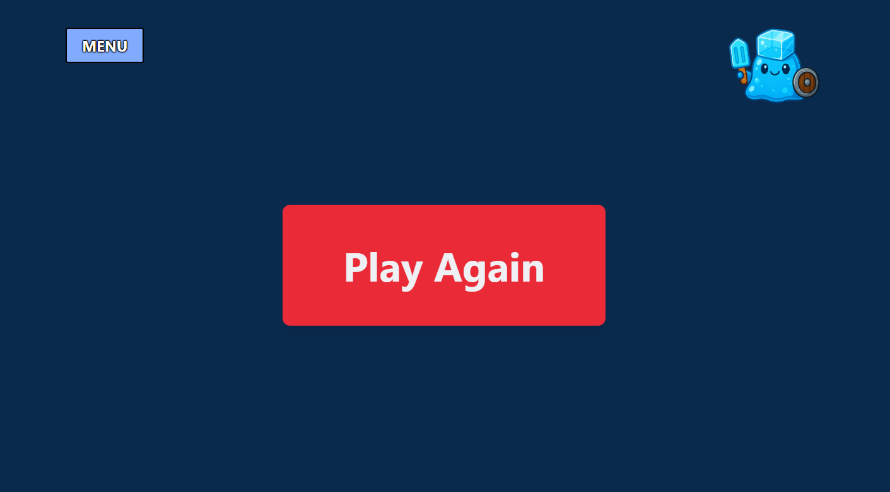

The goal is to create a simplistic game of Memory, where we increase the difficulty per cleared level (Adding more cards to the game)

Step 1: Create necessary data file, we will need a lot of cards which all of them uses the same "back-image", for example a "?" on the backside.
It should have a front-image, a unique ID and a boolean "matched", so we can determine a match.

The match of 2 cards should be determined by comparing the pairId's of the cards.

Example of how a card should look:

const cards = [
{
    pairId: "warrior1"
    frontImage: "/images/warrior.png,
    backImage: "images/hidden.png",
    alt: "Warrior Card"
},
{
    pairId: "wizard1"
    frontImage: "/images/wizard.png,
    backImage: "images/hidden.png",
    alt: "Wizard Card"
}
]

Step 2: Create a reusable card component that accept props from card data.
it should render front and backside images
flipping logic (optional), should show the back if not flipped, or show the front if flipped or matched.
Calls an onclick callback when clicked
Should be able to be disabled (so you can't tap the same card twice)
should include alt text for accessabii.lty

Step 3: Create a "game container"
Should be filled with different amount of cards depending on "level".

Should keep track of:
Current score, Max attempts remaining, Current level, Deck (array of cards for this round), State of each card (hidden, flipped, or matched)
useState required, no fuzzy business with "let score = score + 1".

Logic:
Increase level after all pairs are matched
Reset score, level, and attempts when the player runs out of attempts.
Allow “Play Again” to restart the game on loss.

Renders:
Title (H1Title)
Title (ReusableH2) - components are always nice if its reusable ;D
Current score (ScoreCounter)
Current level (ScoreCounter with text "Level")
Remaining attempts
Container with flex/grid which holds the cards (flex-wrap could be nice if not grid)

Step 4: Create function that starts a game.
Either the game starts once rendered or you create a play button, should have same functionality as the play again button, where we reset the gamestate from scratch.
First level fills the playarea with 2 pairs of cards (4 cards), and each level increases it by 1 pair.

Step 5: Use a shuffle algorithm to randomize the card deck to ensure an unique gameplay each time.

Step 6:
On first click of a card you flip it/reveal it, on second click of another card you compare if x.pairId === y.pairId, and if so you increase score by 2, the cards remain visible, attemps are not reduced on correct guess.
If not correct the cards turn back to hidden after a delay, attempts get reduced by 1.

Only 2 cards can be clicked at once, block input on other cards when 2 are selected.

Step 7: Win/Loss conditions.
Win: All cards have been matched, this increases the lvl, adds a pair and reshuffles for a new deck each time.
Loss: Attempts reach 0, this should display a "play again button", which resets all values. Level 1, score 0, attempts 10, deck with 2 pairs.

//Written by yours truly, mr Alexander Hallgren